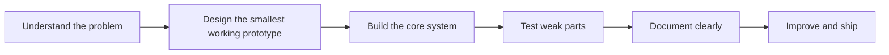

<div align="center">

# ⚔️ FluxKnight / V01d_404

### Student Developer from Mongolia  
**AI Engineering • Backend Systems • Defensive Cybersecurity • C++ / Python • Hackathon Builder**

<br />

[](https://fluxknight.github.io/portfolio/)
[](https://github.com/FluxKnight)
[](https://github.com/FluxKnight)
[](https://github.com/FluxKnight)

<br />


</div>

---

## 🧭 Mission Profile

```txt
codename     :: FluxKnight / V01d_404
team         :: NOtFound_404
location     :: Mongolia
mode         :: prototype fast, explain clearly, improve through testing
focus        :: AI engineering + backend + cybersecurity + game engineering
ethics       :: defensive security, legal CTF, educational tools only
```

I’m a student developer focused on turning technical ideas into working prototypes.

My current direction is building **AI-assisted backend tools**, **defensive cybersecurity projects**, **CTF practice workflows**, and **game/software experiments**. I like projects that are practical, explainable, and useful for real people.

> I do not want to only learn technology.  
> I want to build things that prove I can think, ship, debug, and improve.

---

## ⚡ Current Focus

<table>
<tr>
<td width="33%">

### 🛡️ Defensive Security
- Static analysis
- URL risk scoring
- Secure coding awareness
- Legal CTF practice
- Security explanations

</td>
<td width="33%">

### 🧠 AI Engineering
- AI-style explanations
- Rule-based intelligence
- Developer tools
- Report generation
- Practical automation

</td>
<td width="33%">

### ⚙️ Backend Systems
- FastAPI APIs
- SQLite / SQLAlchemy
- Clean architecture
- Service layers
- API documentation

</td>
</tr>
</table>

---

## 🧰 Tech Arsenal

### Languages

<p>
  
  
  
  
  
</p>

### Backend & Tools

<p>
  
  
  
  
  
  
</p>

### Security & Workflow

<p>
  
  
  
  
  
</p>

---

## 🚀 Featured Builds

<table>
<tr>
<td width="50%">

### 🛡️ DevGuard AI

**AI-style code security reviewer backend**

A FastAPI project that scans source code for risky patterns such as hardcoded secrets, SQL injection-style patterns, unsafe shell execution, weak hashes, and debug configs. It generates a risk score, human-readable findings, recommendations, review history, a simple UI, and Markdown reports.

**Tags:** `Python` `FastAPI` `Cybersecurity` `Static Analysis` `Developer Tools`

<br />

[](https://github.com/FluxKnight/DevGuard-AI)

</td>
<td width="50%">

### 🦋 AegisLink

**Defensive URL risk analysis API**

A backend API that analyzes suspicious URLs using static rules. It checks for suspicious keywords, missing HTTPS, long URLs, IP-based domains, suspicious TLDs, URL shorteners, and brand impersonation hints. It explains risk clearly and generates Markdown security reports.

**Tags:** `Python` `FastAPI` `URL Analysis` `Risk Scoring` `Security API`

<br />

[](https://github.com/FluxKnight/AegisLink)

</td>
</tr>
<tr>
<td width="50%">

### 🌐 Cyber Mission Portfolio

**Personal portfolio for hackathon applications**

A dashboard-style portfolio that presents my profile, technical stack, projects, roadmap, security practice, and collaboration direction. Built to show my growth as a student developer and hackathon-ready builder.

**Tags:** `HTML` `CSS` `JavaScript` `Portfolio` `GitHub Pages`

<br />

[](https://fluxknight.github.io/portfolio/)
[](https://github.com/FluxKnight/portfolio)

</td>
<td width="50%">

### 🎮 Runner Void

**Python / Pygame survival game**

A dark runner-style game project focused on movement, collision detection, scoring, gameplay loops, and visual mood. This project helps me practice game engineering and interactive system design.

**Tags:** `Python` `Pygame` `Game Engineering` `Game Loop` `Prototype`

<br />

[](https://github.com/FluxKnight/Runner_void)

</td>
</tr>
</table>

---

## 🤝 Team Build

### 🧢 Aura_Guide — NOTFound_404

A smart assistive wearable concept built with the **NOtFound_404** team.  
The project explores accessibility, sensor-based obstacle detection, Bluetooth communication, mobile interaction, and Mongolian voice warning support.

This project taught me that good engineering is not only about code. It is also about teamwork, user safety, product thinking, and building something that can help people in daily life.

[](https://github.com/BeBecpp/Aura_Guide)

---

## 🧪 How I Build



My build style is simple:

1. **Problem first** — understand what the user or challenge actually needs.  
2. **Prototype fast** — create the smallest version that proves the idea.  
3. **Structure cleanly** — separate API, services, models, schemas, and docs.  
4. **Explain clearly** — make projects understandable through README files and reports.  
5. **Improve daily** — test, debug, polish, and keep moving.

---

## 📊 GitHub Signal

<div align="center">


<br />
<br />


</div>

---

## 🎯 Learning Roadmap

```txt
[01] Programming Foundation
     C++, Python, algorithms, debugging, clean project structure

[02] Backend Engineering
     FastAPI, databases, APIs, service layers, testing, deployment

[03] Defensive Cybersecurity
     Legal CTF, web basics, Linux workflow, secure coding, writeups

[04] AI Engineering
     AI-style explanations, automation, developer tools, practical workflows

[05] Hackathon Mode
     Teamwork, rapid prototyping, project presentation, shipping under pressure
```

---

## 🛡️ Security Ethics

My cybersecurity practice is focused on:

- legal CTF challenges
- authorized labs
- defensive tooling
- secure coding awareness
- educational security projects
- clear documentation and responsible learning

I do **not** build tools for stealing, phishing, malware, bypassing systems, or attacking real targets.

---

## 🏷️ Identity Tags

<p>
  
  
  
  
  
  
  
</p>

---

## 📬 Contact

I’m open to hackathon teams, CTF collaboration, programming projects, cybersecurity learning, and practical prototype building.

<div align="center">

[](https://fluxknight.github.io/portfolio/)
[](https://github.com/FluxKnight)

<br />

### ⚔️ FluxKnight  
**Build secure. Ship clean. Learn fast.**

</div>
